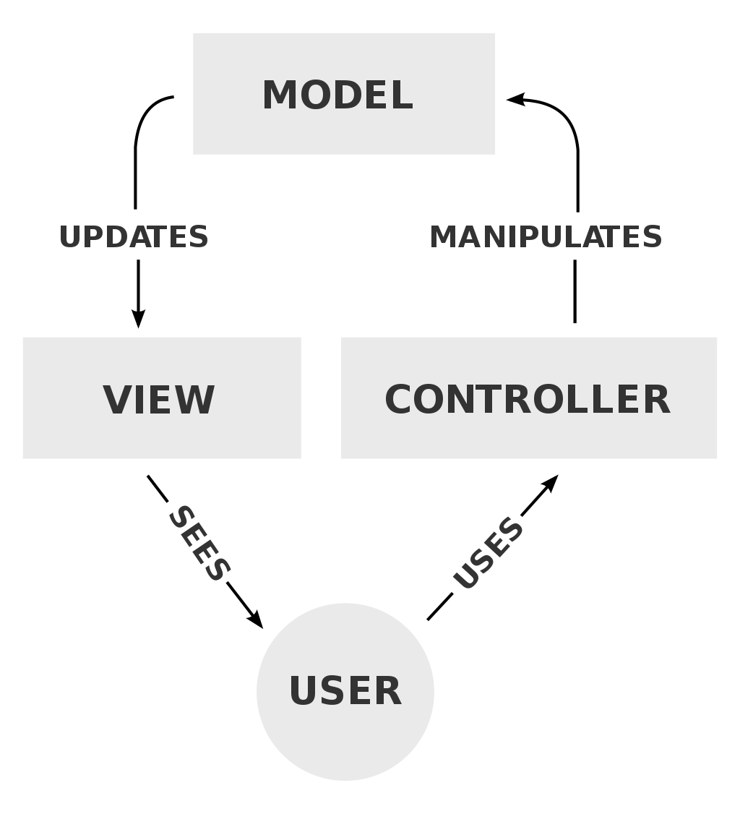

# Application monolithe

<!-- .slide: class="page-title" -->

## Programme

<!-- .slide: class="toc" -->

 - [Introduction](#/0)
 - **[Application monolithe](#/1)**
 - [Architecture n-tier](#/2)
 - [Acrhitecture orientée services](#/3)
 - [Ressources vidéos](#/4)

## Historique

 > "In software engineering, a monolithic application describes a single-tiered software application in which the user interface and data access code are combined into a single program from a single platform." Wikipedia

 - Initialement, applications sans modularité ou possibilité d'évolution
 - Fonctionnant sur des mainframes

<figure style="margin-top: 5%; margin-bottom: 5%;">
    
</figure>

## De nos jours

 Décrit souvent une application client-serveur "old school", le serveur s'occupant de la récupération et du traitement des données, le client affiche des reponses statiques fournies par le serveur

## Avantages

 - Une codebase, unité du contenu et de fonctionnalité
 - Adapté au cycle en V
 - Facile à tester

## Inconvénients

 - Travail en équipe plus complexe
 - Besoins clairement définis à l'avance
 - Difficulté d'ajout de fonctionnalité et maintenabilité
 

## Evolution

Pour séparer la logique métier de l'accès aux données et de la présentation, un *design pattern* courrament utilisé est le Model-View-Controller (MVC)

<figure style="margin-top: 5%; margin-bottom: 5%;">
    
</figure>

Notes : années 80, mais popularisé par Java Spring, Django Rails etc

## Modèle

Décrit la couche d'accès au données et le schéma de celles-ci, ainsi que leur relations et la façon dont elle sont stockées. C'est ici que l'on trouve les *entités* dans la plupart des frameworks

Un *diagramme de classe* sert le plus souvent à décrire le modèle de données

Il gère la donnée, la logique métier et les différentes règles de l'application, indépendamment de l'interface utilisateur

Notes : application de banque, le modèle représente des comptes, des clients, ainsi que les opérations telles que dépôt et retraits, et vérifie que les retraits ne dépassent pas la limite de crédit. Opérations de CRUD et validations

## Controlleur

Il reçoit les requètes de l'utilisateur et les convertit pour agir sur le modèle ou la vue. Dans une application web, décrit les différentes routes d'accès à l'application et aux pages qui la compose

## Vue

C'est la couche de présentation des données, l'interface utilisateur qui lui permet de requeter et d'envoyer des modifications vers le modèle de données. Plusieurs vues pour une même information sont possibles, selmon les besoins des utilisateurs

## Avantages

 - Développement en paralelle plus simple
 - Découplage des composants du système, plus grande indépendance de chaque
 - Cohésion des fonctionnalités et des responsabilités
 - Ajout de fonctionalités ou modifications simplifiés

## Inconvénients

 - Nécessité de s'adapter au contraintes du framework et d'appréhender les abstractions
 - Fonctionnalité décomposée en 3 éléments, donc plus difficille à maintenir
 - Besoin de connaitre plusieurs technologies (gestion des données, langages de templates...)

## Synthèse

 - Adapté à des applications aux fonctionnalités bien définies à l'avance
 - Nombreux frameworks aidant à la mise en place
 - Evolutions possbiles mais attention au **"plat de spaghettis"**

<figure style="margin-top: 5%; margin-bottom: 5%;">
    
</figure>

## Questions

<!-- .slide: class="page-questions" -->
