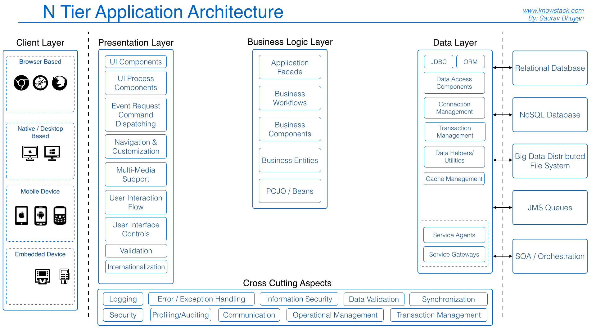

# Architecture n-tier

<!-- .slide: class="page-title" -->

## Programme

<!-- .slide: class="toc" -->

 - [Introduction](#/0)
 - [Application monolithe](#/1)
 - **[Architecture n-tier](#/2)**
 - [Architecture orientée services](#/3)
 - [Microservices](#/4)

## Définition

Architecture en couches, en modules indépendants pouvant se trouver sur des plateformes différentes

<figure style="margin-top: 5%; margin-bottom: 5%;">
    
</figure>

## Définition Plus précisement

Consiste à concevoir une application en différentes parties indépendantes et pouvant utiliser des technologies différentes, afin de faciliter leur amélioration ou remplacement au cours du cycle de vie de l'application

<figure style="margin-top: 5%; margin-bottom: 5%;">
    
</figure>

## Détails

Séparer les différents niveaux de l'application permet de decoupler les éléments entre eux. Cela ouvre la possibilité de connecter différentes interfaces utilisateurs sur différents support, par exemple. 

## Comment?

Cela implique de faire communiquer entre eux les éléments de l'application. Il existe pour cela différentes methodes: Sockets, UDP, webservices

## Webservices

 > "a Web service is a server running on a computer device, listening for requests at a particular port over a network, serving web documents (HTML, JSON, XML, Images), and creating web applications services, which serve in solving specific domain problems over the web (www, internet, HTTP)" Wikipedia

## Comment ça marche

Pour chaque élément de l'application, créer des routes pour permettre la communication. Il est important de bien définir avant des contrats d'interfaces. Un contrat d'interface est le format de données attendus par la route ainsi que les différentes réponses selon le resultat de la requète.

Un contrat d'interface, comme son nom l'indique, se doit d'être respecter sous peine de bloquer l'application.

<!-- .slide: class="page-questions" -->
