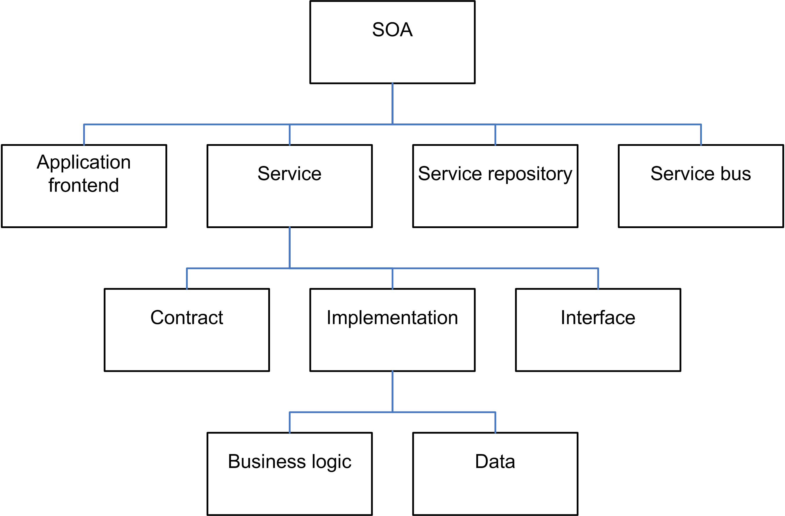

# Service Oriented Architecture

<!-- .slide: class="page-title" -->

## Programme

<!-- .slide: class="toc" -->

 - [Introduction](#/0)
 - [Application monolithe](#/1)
 - [Architecture n-tier](#/2)
 - **[Architecture orientée services](#/3)**
 - [Microservices](#/4)

## Définition

 > "Service-oriented architecture (SOA) is a style of software design where services are provided to the other components by application components, through a communication protocol over a network. The basic principles of service-oriented architecture are independent of vendors, products and technologies." Wikipedia

## Défintion Plus précisément

Construire un système basé sur des composant maintenus et déployés séparement. Cela permet de réutiliser et modulariser des éléments applicatifs du système d'information. Le resultat peut être comparable en terme de fonctionnalités à une application logicielle lourde.

## Les grand principes

 - Architecture _Consumer - Producer_ (Client - Serveur)
 - Représente un élément metier avec un resultat spécifié
 - Boite noire pour le Consumer
 - Indépendant des autres services
 - Peut être constitué d'autres services

Notes : Indépendants dans le sens de pas code partagé

## Avantages

 - Plus facilement remplaçables pour suivre l'évolution du SI
 - Plus petits et avec un périmètre bien défini
 - Reusabilité au niveau macro (service) plutôt que classes ou packages
 - Possibilité de se racrocher au __legacy__ du SI

## Inconvénients

 - Hétérogéneité des technos et complexité du système
 - Difficultés des tests, nombreuses combinaisons possibles
 - Dépendant du réseau et de l'infrastructure (__fault tolerant__)
 - SI changeant dû aux nouveaux services et fonctionnalités

## Les briques du SOA

 - _Service provider_: Expose un __webservice__ et déclare ses informations auprès du __service registry__
 - _Service registry_: Annuaire des services et de leur fonctionnalités, ainsi que comment les joindres
 - _Service consumer_: Consommateur de données, pouvant contacter plusieurs services à l'aide de la __registry__

Notes : Consistance du nommage et des modèles de données pour eviter d'avoir à transformer celles-ci

## Les éléments du SOA

<figure style="margin-top: 5%; margin-bottom: 5%; width: 85%;">
    
</figure>

## Questions

<!-- .slide: class="page-questions" -->
